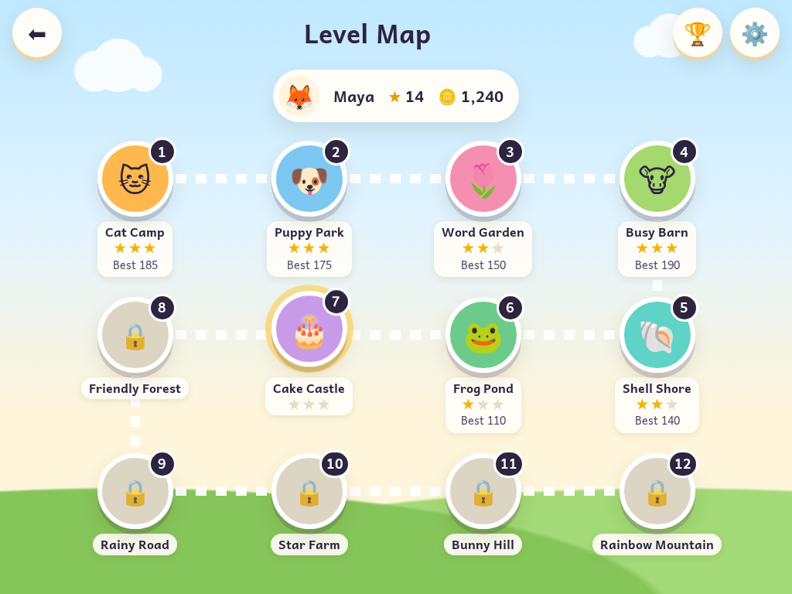
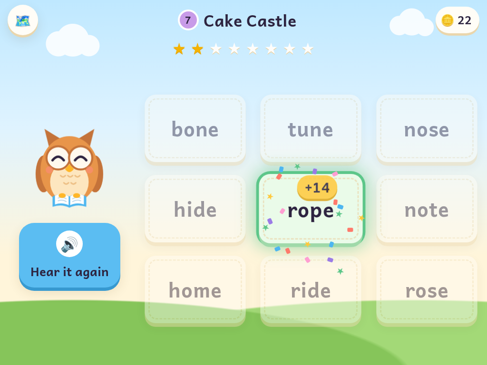
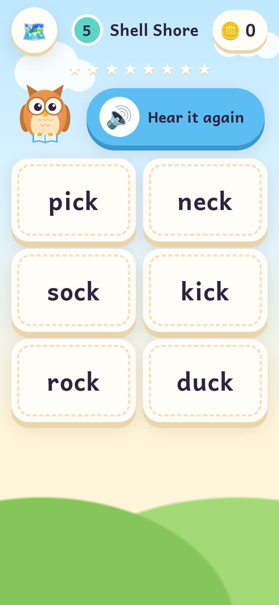
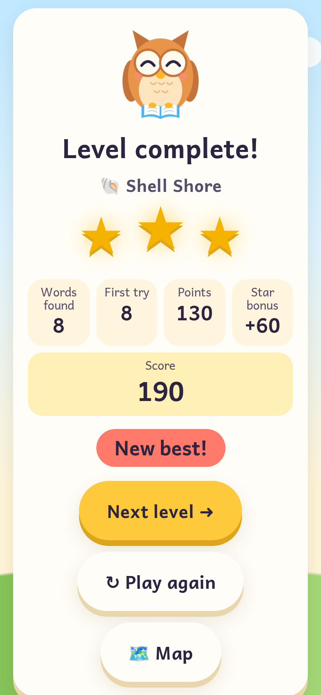

# Reading Game

**Listen, look, and find the word!** A bright, playful reading game for young
children. Pip the owl says a word out loud, and your child taps the card that
matches.

**Play it:** <https://rdbagwell.github.io/Reading_Game/>

When my daughter was in first grade, I noticed she didn't like the reading assignments her teacher had her do. She, however, liked playing video games; that is when I got the idea to create this game.

**Then and now:** the original game is preserved at the
[`v1-original`](https://github.com/RDBagwell/Reading_Game/tree/v1-original) tag.
It was about 150 lines of vanilla JavaScript. This rebuild keeps its core loop
and adds everything around it.



| Playing on a tablet | On a phone | Level complete |
|---|---|---|
|  |  |  |

## How to play

1. Tap **Tap to play**, then choose your reader (or make a new one: pick an
   animal and type a name).
2. Pick a level on the map.
3. Pip says *"Find the word… cat."* Tap the card that says **cat**. Tap
   **🔊 Hear it again** as often as you like.
4. A wrong tap is never punished. The game reads the word you tapped (*"That
   word is hat"*), then asks again, so every mistake becomes a small lesson.
   Missed words come back later in the level for another try.
5. Find 8 words to finish the level. You earn 1–3 stars for how many you got on
   the first try, and the next level opens.

**Keyboard:** number keys **1–9** pick a card, **R** repeats the word.

### Scoring

- **+10** for a first-try answer, **+5** on the second try, **+2** after that.
- **Streak bonus** for first-try answers in a row: +2, +4, +6… up to +10.
- **Level bonus:** +20 per star.
- Points are never taken away, and there is no "game over".

The **Best Readers on This Device** board shows the top 10 readers by total
score. Each stepping stone on the map shows that reader's stars and best score.

### Grown-ups' corner

Tap ⚙️ and **press and hold for 3 seconds** (little hands tap; grown-ups hold).
There you can:

- choose the voice and speaking speed (default 0.85×, a little slow for young ears)
- turn sound effects on or off
- show words in **lowercase** (how early readers are taught; "I" stays a
  capital) or **Title Case**
- unlock all levels
- rename, reset or delete readers (up to 6 per device)
- read how to play and what each level practises

## The levels

The levels follow a standard early-reading (phonics) sequence, with common
sight words mixed in. Difficulty also comes from the **wrong choices**: early
levels use words that start with different letters (practising first sounds),
then rhyming words (*cat / hat / bat*: read the first letter), then look-alikes
(*ship / shop / chip*: read the whole word).

| # | Level | Practises | Cards | Wrong choices |
|---|---|---|---|---|
| 1 | 🐱 Cat Camp | Short-*a* words (cat, map, van) | 3 | different start |
| 2 | 🐶 Puppy Park | All short vowels (dog, pig, bed, sun) | 4 | different start |
| 3 | 🌷 Word Garden | First sight words (the, and, you, I) | 4 | different start |
| 4 | 🐮 Busy Barn | Word families + sight words | 6 | rhyme |
| 5 | 🐚 Shell Shore | *sh, ch, th, wh, ck* (ship, chin, that, duck) | 6 | look-alike |
| 6 | 🐸 Frog Pond | Consonant blends (frog, stop, clap, jump) | 6 | mixed |
| 7 | 🎂 Cake Castle | Silent *e* (cake, bike, home, cute) | 9 | look-alike |
| 8 | 🌳 Friendly Forest | More sight words (said, was, they, come) | 9 | mixed |
| 9 | ☔ Rainy Road | Vowel teams (rain, boat, feet, play, snow) | 9 | look-alike |
| 10 | ⭐ Star Farm | Bossy *r* (car, bird, corn, her) | 9 | look-alike |
| 11 | 🐰 Bunny Hill | Two-syllable words (rabbit, sunset, kitten) | 9 | mixed |
| 12 | 🌈 Rainbow Mountain | Big review, with every word from v1 | 9 | mixed |

Every word from the original game (dog, cat, the, hop, hat, bat, house, cake,
ball, box, fox, mouse, home, rat) is still in there. The tests also make sure
no two words in the game sound the same (*to/two*, *see/sea*), because the child
only *hears* the target.

### Adding words or levels

All words live in [`data/levels.json`](data/levels.json). The format, the
distractor modes and the rules are explained in
[`data/README.md`](data/README.md). After editing, run `npm test`: it checks
the file and names any problem in plain words.

## Privacy

The players are children, so the game is built to collect nothing:

- **No accounts, no analytics, no trackers, no ads.**
- **No network requests at all** beyond loading the game's own files. The font
  is self-hosted; there are no third-party scripts, fonts or images.
- **Everything stays on the device.** Reader names, scores and settings are
  saved in the browser's `localStorage` on that device only, and never leave
  it. If the browser blocks storage (for example in private browsing), the game
  still works; it just doesn't remember anything.
- Speech comes from the browser's built-in voices. Some browsers or operating
  systems may use an online voice service for certain voices; the game itself
  sends nothing.

A strict Content Security Policy (`default-src 'self'`, no inline scripts)
enforces the "own files only" rule in the browser.

## Running it locally

There is no build step: the site is plain HTML, CSS and JavaScript modules.
Because it uses ES modules and loads `data/levels.json`, serve the folder
over HTTP rather than opening `index.html` from disk:

```sh
npm start                 # uses npx http-server on http://localhost:8080
# or
python3 -m http.server 8080
```

The game needs a browser with speech synthesis (recent Safari, Chrome, Edge or
Firefox). If there isn't one, the game shows a note for grown-ups instead.

## Tests

```sh
npm install
npm test
```

[Vitest](https://vitest.dev/) (with jsdom) covers level data validation,
distractor selection for each mode, target picking and missed-word review,
scoring and streaks, stars, profile names, storage (save, load, migration,
corrupted data, blocked storage), speech (with a mocked `speechSynthesis`, so no
audio is needed), the security rules, and a full play-through of level 1 in
jsdom.

## Deployment

[`.github/workflows/pages.yml`](.github/workflows/pages.yml) runs the tests on
every push and pull request. On a push to `main` (or `master`, the current
default branch), it deploys only the game's files to GitHub Pages. All paths
are relative, so it works from `/Reading_Game/`.

One-time setup: in the repository's **Settings → Pages**, set **Source** to
**GitHub Actions**.

The site includes a web app manifest and icons, so it can be added to a
tablet's home screen and launched full-screen. There is no service worker, so
it needs a connection to load. That keeps updates simple, with no stale caches.

## How it's built

```
index.html              the page (strict CSP, no inline scripts)
css/style.css           the whole look, including Pip's animations
data/levels.json        all the words
fonts/                  Andika (SIL Open Font License), self-hosted
icons/                  app icons, drawn from the mascot
js/main.js              start-up
js/router.js            shows one screen at a time
js/screens/*.js         start, readers, map, play, level complete, scores, gate, settings
js/round.js             one play-through: next word, review, answers   (pure)
js/distractors.js       choosing the wrong answers                     (pure)
js/scoring.js           points, streaks, stars                         (pure)
js/progress.js          unlocking and bests                            (pure)
js/profiles.js          names, avatars, the high-score board           (pure)
js/storage.js           the versioned localStorage record
js/speech.js            voices and speaking
js/sfx.js               Web Audio sound effects (no audio files)
js/mascot.js            Pip the owl, drawn in SVG
```

All text on screen, including a reader's name, is set with `textContent`.
There is no `innerHTML`.

### Art, sound and font

- **Pip the owl** and all other art are original: SVG, CSS gradients and emoji.
- **Sounds** are generated live with the Web Audio API. There are no audio
  files, and there is no buzzer: a wrong answer gets a soft, neutral "boop".
- **Andika** by SIL International is a typeface designed for beginning readers,
  with the single-story *a* and *g* children learn to write. It's licensed under
  the [SIL Open Font License](fonts/OFL.txt).

### Icons

`node scripts/make-icon-svg.mjs` rebuilds `icons/icon.svg` from the mascot
drawing. The PNGs (`icon-180/192/512.png`) were rendered from that SVG in a
headless browser at those sizes. Any SVG-to-PNG tool works.
