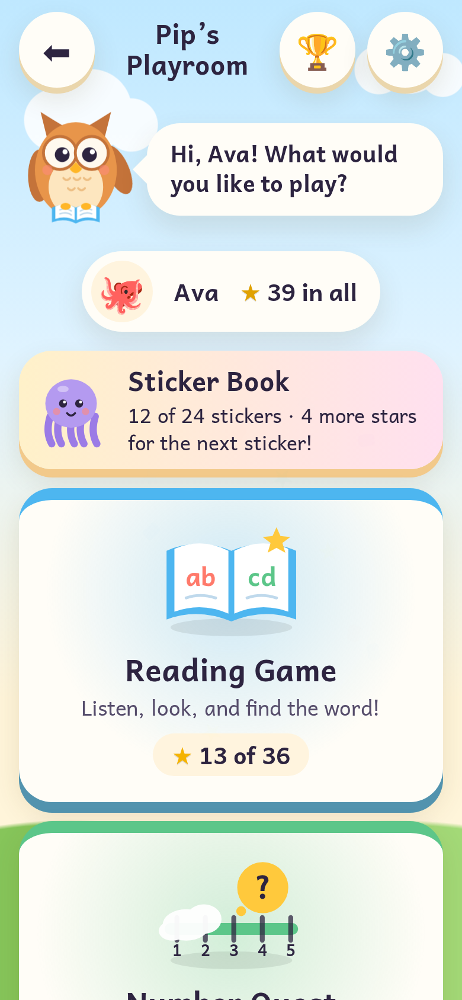
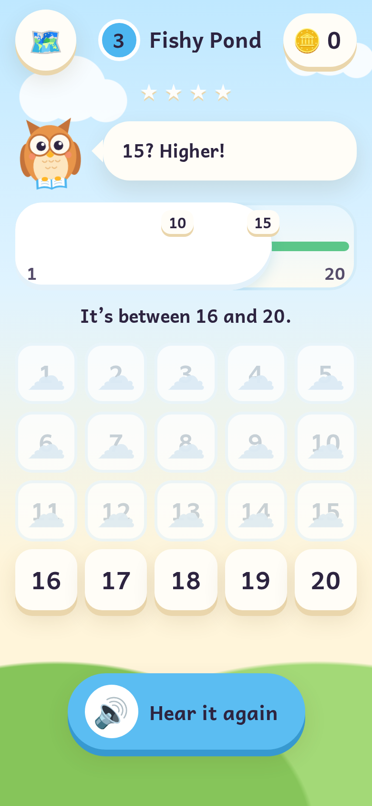
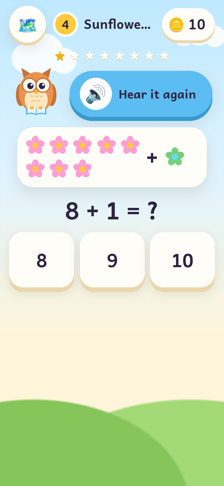
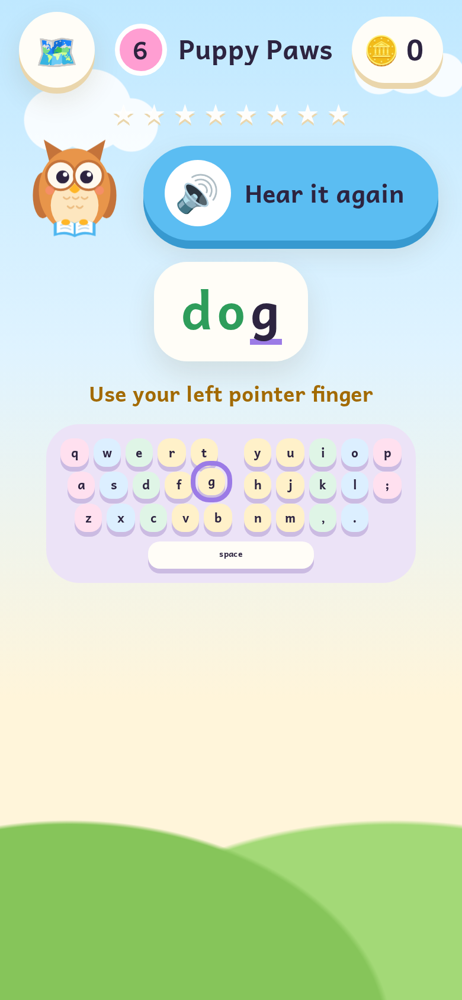
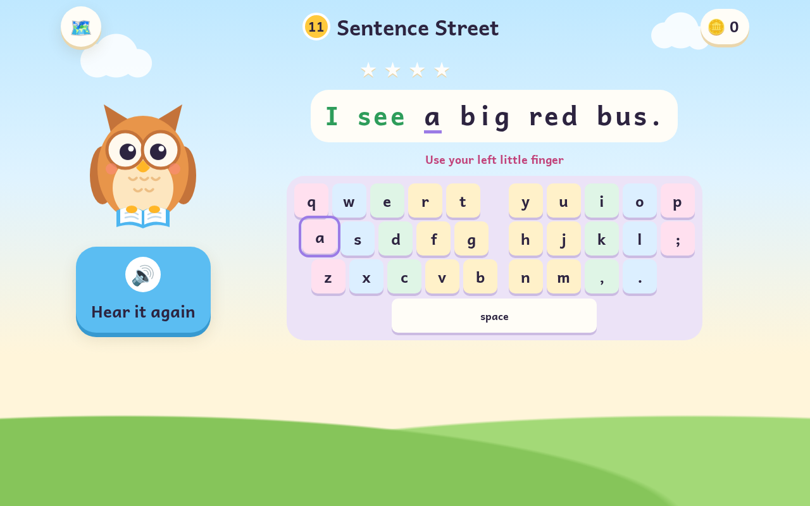
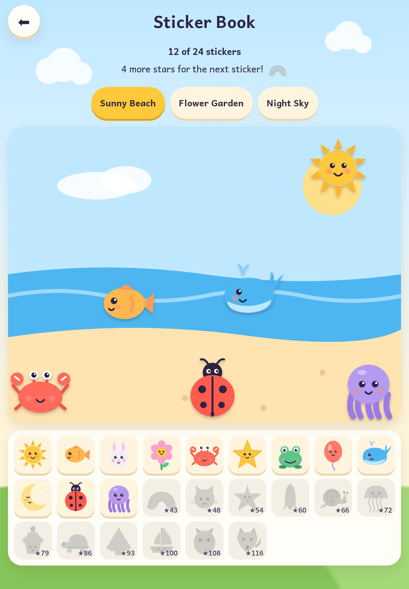
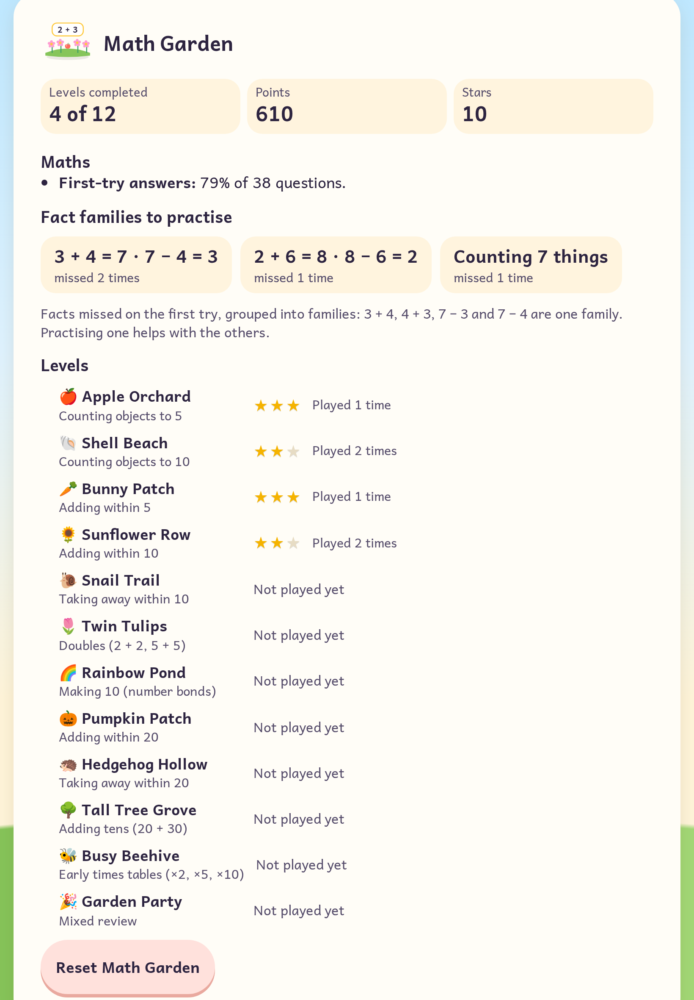

# Pip's Playroom

**Four gentle learning games for young children (about ages 4–8), with Pip the owl.**
Reading, numbers, maths and typing, in one place, with a shared sticker book.
No accounts, no ads, no tracking: everything stays on the device.

**Play it:** https://rdbagwell.github.io/pips-playroom/

| The playroom | Number Quest | Math Garden | Type with Pip |
|---|---|---|---|
|  |  |  |  |

## Why it exists

When my daughter was in first grade, I noticed she didn't like the reading
assignments her teacher had her do. She, however, liked playing video games;
that is when I got the idea to create this game.

<!-- TODO(Robert): extend the story. How did the Reading Game grow into a
playroom? What did she think of Number Quest, Math Garden and Type with Pip?
What did you learn rebuilding your early projects? A few sentences is plenty. -->

## The games

| Game | What it teaches | Started as |
|---|---|---|
| 📖 **Reading Game** | Hearing a word and finding it: 12 phonics levels from short-*a* words to two-syllable words, with sight words | [`Reading_Game`](https://github.com/RDBagwell/Reading_Game) |
| 🔢 **Number Quest** | Number order, comparing, and the "start in the middle" halving strategy, from 1–5 to 1–100 | [`Speak_Number_Guessing_Game`](https://github.com/RDBagwell/Speak_Number_Guessing_Game) |
| 🌻 **Math Garden** | Counting, adding and taking away, doubles, making 10, adding tens and the 2, 5 and 10 times tables | [`Math_Sprint_Game`](https://github.com/RDBagwell/Math_Sprint_Game) |
| ⌨️ **Type with Pip** | Finding letters on a real keyboard, then typing and spelling the Reading Game's words and short sentences | [`Typing_Game`](https://github.com/RDBagwell/Typing_Game) |

**Reading Game.** Pip says a word; the child taps the card that matches. The
wrong choices are deliberate (different first letters, then rhymes, then
look-alikes), a wrong tap reads the tapped word aloud ("That word is hat"),
and missed words come back later in the level.

**Number Quest.** Pip is thinking of a number; the child guesses and Pip says
"Higher!" or "Lower!". Clouds roll over the numbers that are ruled out, the
first levels show dot pictures and ten-frames, and big ranges use a number
pad. An optional hint suggests the middle. Stars compare the guesses with the
best possible (halving finds any number from 1 to 100 in 7 guesses).

**Math Garden.** Two kinds of question: "Is this right? 3 + 2 = 5" (a big ✔
or ✘) and "4 + 3 = ?" with three or four answers. The wrong answers are
believable mistakes (one off, the operation swapped, a times-table neighbour).
Countable SVG pictures fade out as levels rise, and after a wrong tap Pip
explains and counts along, lighting each object up. Equations are read
naturally: "three plus two equals five". The original was a timed sprint with
penalties; here there's no clock unless a grown-up turns on "Beat your own
time", which only counts up.

**Type with Pip.** Pip says a letter, word or sentence and the child types it.
Letters turn green; a wrong key is ignored with a soft sound and the right key
glows on the keyboard picture (optionally coloured by finger). Its word levels
use the Reading Game's word lists, in the same order, so the two games
reinforce each other. On a phone or tablet with no keyboard it says so and
offers a tap-the-keys practice mode.



## The sticker book

Stars from every game add up. Every few stars unlocks one of 24 original
stickers (animals, sea creatures and things, drawn in code in Pip's style),
which the child arranges on a beach, a garden and a night sky. Each sticker
has a fixed, visible star count ("4 more stars for the next sticker!"): no
random rewards, no streaks, nothing time-limited.

| Sticker book | Grown-ups' progress view |
|---|---|
|  |  |

## Grown-ups' corner

Behind a press-and-hold gate (little hands tap; grown-ups hold for 3 seconds):

- **Voice** (on-device voices first) and speaking speed; sounds on or off.
- **Which games are available**, to hide one that isn't right yet.
- **Each game's settings**: word case; Pip's hint and voice answers; always
  show pictures and "Beat your own time"; finger colours, "Listen and spell"
  and words per minute (information only, never a pass mark).
- **Progress for each child**: levels, stars, and what they find tricky in
  each game: missed words, number ranges, fact families, and keys (with the
  finger to use). It's on screen only, with no export and no sharing.
- **About these games**: what each game practises and how the playroom
  keeps children safe, in plain language for parents and teachers.

## Privacy and kid-safety principles

- **Nothing leaves the device.** No accounts, analytics, trackers or ads, and
  no network requests beyond the site's own files (the font is self-hosted).
  Readers, stars, stickers and settings live in one versioned `localStorage`
  record. A strict Content Security Policy (`default-src 'self'`, no inline
  scripts) enforces it, and the tests check it.
- **On-device voices first.** Some browsers' voices (Chrome's "Google US
  English", for example) send the words to a server. The playroom always
  prefers a voice on the device, uses an online voice only when there's no
  English voice on the device, and tells grown-ups when it does.
- **On-device speech recognition only.** Number Quest's voice answers are off
  by default, switched on only by a grown-up, and only where the browser can
  recognise speech on the device (`processLocally = true`). Server
  recognition is never used. The microphone is used only after the child
  taps 🎤.
- **Never punish.** No lost points, no "game over", no harsh sounds. Mistakes
  get a gentle explanation and come back later.
- **No manipulative design.** No countdowns, no streaks, no daily rewards, no
  random prizes, nothing "limited time".
- **For small hands.** Touch targets of at least 64px, full keyboard access,
  and reduced motion is respected.
- **Text is text.** Everything on screen, including a child's name, is set
  with `textContent`. There is no `innerHTML`.

## Then and now

Each game started as one of my early projects. The originals are preserved at
their `v1-original` tags:

| Then | Now |
|---|---|
| [`Reading_Game@v1-original`](https://github.com/RDBagwell/Reading_Game/tree/v1-original): about 150 lines, one word list, no levels | Reading Game: 12 phonics levels, deliberate distractors, profiles, stars |
| [`Speak_Number_Guessing_Game@v1-original`](https://github.com/RDBagwell/Speak_Number_Guessing_Game/tree/v1-original): guess 1–100 by speaking, using server speech recognition | Number Quest: six levels with a narrowing number line, hints, halving stars; speech optional and on-device only |
| [`Math_Sprint_Game@v1-original`](https://github.com/RDBagwell/Math_Sprint_Game/tree/v1-original): timed ×-table true/false, with time penalties for mistakes | Math Garden: a 12-level early-maths ladder with pictures; no timer by default, nothing ever subtracted |
| [`Typing_Game@v1-original`](https://github.com/RDBagwell/Typing_Game/tree/v1-original): type "highfalutin" before a 10-second timer runs out | Type with Pip: letters to sentences using the Reading Game's words, no timer, accuracy-only stars |

## Running it

There is no build step: the site is plain HTML, CSS and JavaScript modules.
Serve the folder over HTTP (ES modules and the level data don't load from `file://`):

```sh
npm start                 # npx http-server on http://localhost:8080
# or
python3 -m http.server 8080
```

The games need speech synthesis (recent Safari, Chrome, Edge or Firefox).
Without it, the playroom shows a note for grown-ups.

## Tests

```sh
npm install
npm test                  # Vitest + jsdom
npm run screenshots       # retakes docs/screenshots/ with Playwright's Chromium
```

The tests cover:

- **Each game:** level data, question generation (for every Math Garden level:
  answers right, distractors plausible and in range, balanced true/false),
  scoring and stars, keystroke matching (Shift, Caps Lock, auto-repeat), the
  shared word lists, keyboard detection, spoken-number parsing, and
  end-to-end play through the real screens in jsdom.
- **The core:** storage and migrations (including importing the old Reading
  Game record), voice ranking, on-device-only recognition (a mocked
  `SpeechRecognition` in every availability state), stickers, and the
  grown-ups' corner.
- **The rules:** the CSP, no network access, no HTML strings, no clashing
  styles between games, and the old-URL redirect.

The screenshot script fails if a page logs an error, requests anything from
another site, or scrolls sideways.

## What to look at

If you're reviewing this as a portfolio piece, these are the interesting parts:

- **[`core/registry.js`](core/registry.js)**: one small interface for a game
  (data, screens, settings spec, grown-ups' section, progress report). Adding
  a game means adding a folder plus one `registerGame()` line in
  [`games/index.js`](games/index.js).
- **[`core/storage.js`](core/storage.js)**: one versioned record with
  migrations (the Reading Game's v1 → the playroom's v2 → sticker books in
  v3), sanitized like untrusted input, and a one-time import of the old
  game's players that never touches their original data.
- **[`core/speech.js`](core/speech.js) and [`core/recognition.js`](core/recognition.js)**:
  the on-device-first voice ranking and the on-device-only recognition gate.
- **[`games/math-garden/questions.js`](games/math-garden/questions.js)** and
  **[`games/reading/distractors.js`](games/reading/distractors.js)**: wrong
  answers chosen on purpose, because they decide what the child learns.
- **[`games/typing/keys.js`](games/typing/keys.js)**: keystroke rules that
  never delete or punish, and the finger zones.
- **[`tests/core/styles.test.js`](tests/core/styles.test.js)**: a small
  guard that came from a real bug. Every game's stylesheet loads on every
  page, so one game's `.typed` restyled another game's letters.

## How it's built

```
index.html                 the page (strict CSP, no inline scripts)
css/                       the shared look, the hub and grown-ups' corner
core/                      shared by every game
  registry.js              registerGame(): how a game joins the playroom
  storage.js               the one versioned record + migrations
  profiles.js progress.js  readers, and each reader's progress per game
  stickers.js sticker-art.js   the sticker book and its art
  speech.js recognition.js voices (on-device first), on-device recognition
  sfx.js mascot.js effects.js  Web Audio sounds, Pip in SVG, confetti
  screens/                 start, readers, hub, level map, level complete,
                           scores, gate, settings, progress, stickers, about
games/index.js             the list of games (one registerGame() each)
games/<game>/              game.js, screens/play.js, its logic and style.css
data/<game>/levels.json    each game's levels (with a README per game)
docs/legacy-redirect/      the page that moves the old Reading Game URL here
```

### Adding a game

1. Make `games/<id>/game.js` exporting a definition (`id`, `title`,
   `tagline`, `practises`, `icon()`, `data`, `loadLevels()`, `start`,
   `screens`, and optionally `settings`, `settingsSection()`, `report()`,
   `stylesheet` and `link()`). The full shape is documented in
   [`core/registry.js`](core/registry.js).
2. Put its levels in `data/<id>/levels.json`.
3. Add one `registerGame()` call to [`games/index.js`](games/index.js), and
   the id to `tests/helpers/games.js`.

The shared `createLevelMap()` and `createLevelComplete()` give it a map and
a celebration. Its stars count towards the sticker book automatically.

## Deployment

[`.github/workflows/pages.yml`](.github/workflows/pages.yml) runs the tests on
every push and pull request, and on `main` deploys only the site's files to
GitHub Pages (relative paths, so it works from `/pips-playroom/`). One-time
setup: **Settings → Pages → Source: GitHub Actions**. The web app manifest
and icons (drawn from Pip) let it be added to a tablet's home screen. There's
no service worker, so updates are never stuck behind a stale cache.

The old Reading Game URL redirects here once
[`docs/legacy-redirect/`](docs/legacy-redirect/README.md) is applied to
the `Reading_Game` repository. Players' progress comes along automatically,
because both sites share the `rdbagwell.github.io` origin.

## Art, sound and font

- **Pip, the stickers, the scenes and every picture** are original: SVG drawn
  in code, CSS gradients and emoji. There are no image files except the app
  icons, which are rendered from Pip (`node scripts/make-icon-svg.mjs`).
- **Sounds** are generated live with the Web Audio API. There's no buzzer: a
  wrong answer gets a soft "boop".
- **Andika** by SIL International, a typeface designed for beginning readers,
  is self-hosted under the [SIL Open Font License](fonts/OFL.txt).
