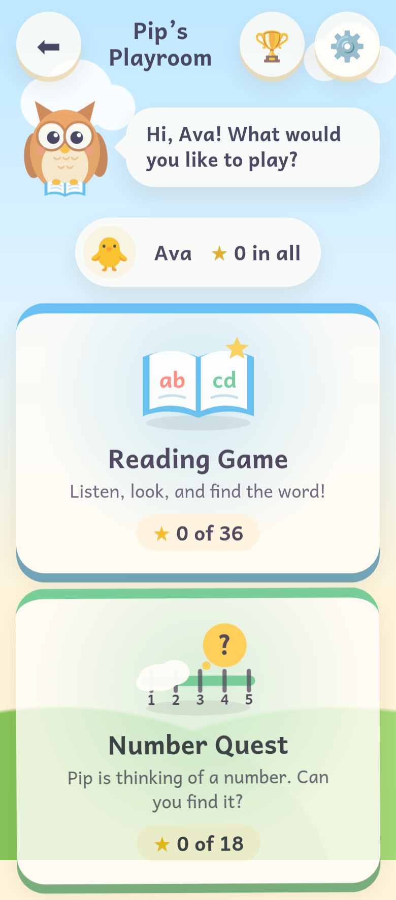
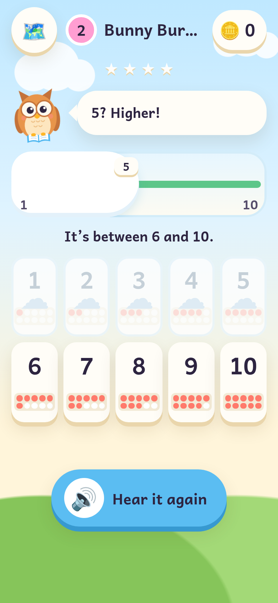
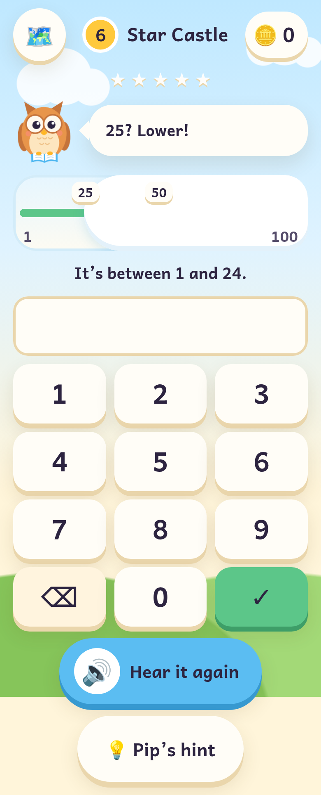

# Pip's Playroom

**Learning games for young children (about ages 4–8), with Pip the owl.**
Choose your reader, then choose a game. Everything stays on the device.

**Play it:** <https://rdbagwell.github.io/pips-playroom/>

| The playroom | Number Quest | Number Quest, 1–100 |
|---|---|---|
|  |  |  |

## The games

| Game | What it teaches | Started as |
|---|---|---|
| 📖 **Reading Game** | Listen, look, and find the word: 12 phonics levels | [`Reading_Game`](https://github.com/RDBagwell/Reading_Game) |
| 🔢 **Number Quest** | Number order, comparing, and the "start in the middle" halving strategy | [`Speak_Number_Guessing_Game`](https://github.com/RDBagwell/Speak_Number_Guessing_Game) |

More are on the way: the Math Sprint and Typing games join next.

The originals are preserved at their repositories' `v1-original` tags.

### Reading Game

When my daughter was in first grade, I noticed she didn't like the reading
assignments her teacher had her do. She, however, liked playing video games;
that is when I got the idea to create this game.

Pip says a word out loud and the child taps the card that matches. A wrong
tap is never punished: the game reads the word they tapped ("That word is
hat"), then asks again, and missed words come back later in the level.
There are 12 levels following a standard phonics order; see
[`data/reading/README.md`](data/reading/README.md) for the levels and how to edit them.


**Keyboard:** number keys **1–9** pick a card, **R** repeats the word.

**Scoring:** +10 for a first-try answer, +5 on the second try, +2 after that;
a small streak bonus for first-try answers in a row; +20 per star at the end.
Points are never taken away.

### Number Quest

Pip is thinking of a number. The child guesses, and Pip says **"Higher!"** or
**"Lower!"** until they find it.

- **A number line that narrows.** Every number is a big tile (numeral, and on
  the first levels a dot picture). After each clue, friendly clouds roll over
  the numbers that are ruled out, on the tiles and on the line above them.
- **Six levels:** 🐞 Ladybug Meadow (1–5), 🐰 Bunny Burrow (1–10, ten-frames),
  🐟 Fishy Pond (1–20), 🚀 Rocket Ridge (1–30), 🏝️ Treasure Island (1–50) and
  🏰 Star Castle (1–100). The last two use a large number pad.
- **Pip's hint**, offered after a few guesses (never required): "Try a number
  in the middle!"
- **Stars** compare guesses with the best possible for the range (halving
  finds any number from 1 to 100 in 7 guesses). Within one guess of that is
  three stars; up to about twice is two; finding the number is always at
  least one. Tapping a number that's already under a cloud isn't counted:
  Pip just repeats the clue.
- **Voice answers** (the original game's main feature) are **off by
  default**, and only a grown-up can switch them on, only where the browser
  can understand speech **on the device**. See [Privacy](#privacy).

**Keyboard:** type a number, **Enter** to guess, **H** for Pip's hint,
**R** to hear Pip again.

Levels live in [`data/number-quest/levels.json`](data/number-quest/levels.json)
([format](data/number-quest/README.md)).

## Grown-ups' corner

Tap ⚙️ and **press and hold for 3 seconds** (little hands tap; grown-ups hold).

- **Voice:** which voice Pip uses (voices on this device come first) and how fast.
- **Sounds** on or off.
- **Games in the playroom:** hide a game that isn't right for your child yet.
- **Each game's settings:** word case and unlocking for the Reading Game;
  Pip's hint, unlocking and voice answers for Number Quest; how each game
  works and what each level practises.
- **Readers:** rename, reset or delete (up to 6 per device), and a
  **progress view** per child: levels completed, stars, the words they find
  tricky, and for Number Quest how they use the clues (mixed-up number pairs,
  how often they start in the middle). It's on screen only: there is no
  export, print or share.

## Privacy

The players are children, so the playroom is built to collect nothing:

- **No accounts, no analytics, no trackers, no ads.**
- **No network requests at all** beyond the site's own files. The font is
  self-hosted; there are no third-party scripts, fonts or images.
- **Everything stays on the device**, in one `localStorage` record. If the
  browser blocks storage (for example in private browsing), the games still
  work; they just don't remember anything.
- **Pip's voice:** speech comes from the browser's voices. Some are
  online voices (Chrome's "Google US English", for example) that send the words
  to a server to be spoken. The playroom always prefers a voice **on this
  device**, uses an online voice only if the device has no English voice of
  its own, and then tells grown-ups so in settings. A grown-up can still pick
  an online voice on purpose.
- **Voice answers** in Number Quest only ever use **on-device** speech
  recognition (`SpeechRecognition.available({ langs: ['en-US'], processLocally: true })`
  and `recognition.processLocally = true`). Where a browser can't promise
  that, the option is hidden and settings explain why. Server-based
  recognition is never used. The microphone is only requested after a
  grown-up has switched voice answers on and the child taps 🎤, and the
  button shows "Listening…" while it listens.

A strict Content Security Policy (`default-src 'self'`, no inline scripts)
enforces the "own files only" rule in the browser, and the tests check it.

### Readers from the old Reading Game

The playroom is served from the same site as the old Reading Game
(`rdbagwell.github.io`), so it can see the old game's saved readers. The first
time it loads on a device with a `reading-game` record and no `pips-playroom`
record, it brings the readers, stars, scores and settings over (checking the
old data like any untrusted input), notes the import, and shows a welcome.
The old record is left exactly as it was.

## Running it locally

There is no build step: the site is plain HTML, CSS and JavaScript modules.
Serve the folder over HTTP (ES modules and the level data don't load from `file://`):

```sh
npm start                 # uses npx http-server on http://localhost:8080
# or
python3 -m http.server 8080
```

The games need a browser with speech synthesis (recent Safari, Chrome, Edge
or Firefox). Without it, the playroom shows a note for grown-ups instead.

## Tests

```sh
npm install
npm test
```

[Vitest](https://vitest.dev/) with jsdom. The tests cover the game
registration interface; storage (save, load, migrations, corrupted data,
blocked storage) and importing the old Reading Game record (real-shaped and
damaged fixtures); voice ranking (on-device first); on-device-only voice
answers (a mocked `SpeechRecognition` reporting every availability state);
the Reading Game's level data, distractors, rounds, scoring and a full
play-through; Number Quest's range narrowing, hints, stars against the
optimal guess count, level data and spoken-number parsing, plus a play-through
of its levels; the hub and grown-ups' corner; and the security rules.

## Deployment

[`.github/workflows/pages.yml`](.github/workflows/pages.yml) runs the tests on
every push and pull request, and on a push to `main` deploys only the site's
files to GitHub Pages. All paths are relative, so it works from `/pips-playroom/`.

One-time setup: in the repository's **Settings → Pages**, set **Source** to
**GitHub Actions**.

The web app manifest and icons (drawn from Pip) let it be added to a tablet's
home screen and launched full-screen. There is no service worker, so updates
are never stuck behind a stale cache.

## How it's built

```
index.html                 the page (strict CSP, no inline scripts)
css/style.css              the shared look (from the Reading Game)
css/playroom.css           the hub and grown-ups' additions
core/                      shared by every game
  main.js                  start-up
  registry.js              registerGame(): how a game joins the playroom
  router.js                one screen at a time
  storage.js               the one versioned localStorage record + migrations
  profiles.js progress.js  readers, and each reader's progress per game
  speech.js sfx.js         Pip's voice (on-device first); Web Audio sounds
  recognition.js           on-device-only speech recognition
  mascot.js effects.js     Pip the owl in SVG; confetti
  screens/                 start, readers, hub, level map, level complete,
                           best scores, gate, settings, progress
games/index.js             the list of games (one registerGame() call each)
games/reading/             the Reading Game
games/number-quest/        Number Quest
data/<game>/levels.json    each game's levels
fonts/  icons/             Andika (SIL OFL), app icons
```

### Adding a game

1. Make a folder `games/<id>/` with a `game.js` that exports a definition:
   `id`, `title`, `tagline`, `color`, `icon()`, `data` (its levels file),
   `loadLevels(json)`, `start`, `screens`, and optionally `settings`,
   `settingsSection()`, `report()` and `stylesheet`
   (the full shape is documented in [`core/registry.js`](core/registry.js)).
2. Put its levels in `data/<id>/levels.json`.
3. Add one `registerGame()` call to [`games/index.js`](games/index.js).

Its screens are registered as `<id>/<screen>`; the shared level map and
"Level complete!" screens come from `createLevelMap()` and `createLevelComplete()`.
Progress is saved per game in `profile.games[<id>]`.

All text on screen, including a reader's name, is set with `textContent`.
There is no `innerHTML`.

### Art, sound and font

- **Pip the owl** and all other art are original: SVG, CSS gradients and emoji.
- **Sounds** are generated live with the Web Audio API. There is no buzzer: a
  wrong answer gets a soft, neutral "boop".
- **Andika** by SIL International is a typeface designed for beginning readers,
  licensed under the [SIL Open Font License](fonts/OFL.txt).
- `node scripts/make-icon-svg.mjs` rebuilds `icons/icon.svg` from the mascot
  drawing. The PNG icons were rendered from it in a headless browser.
